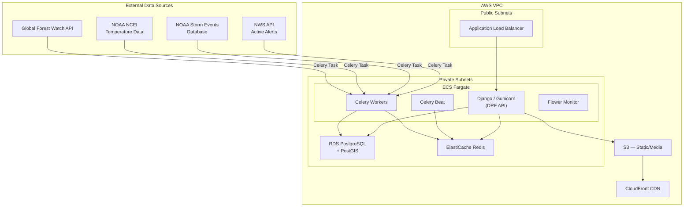
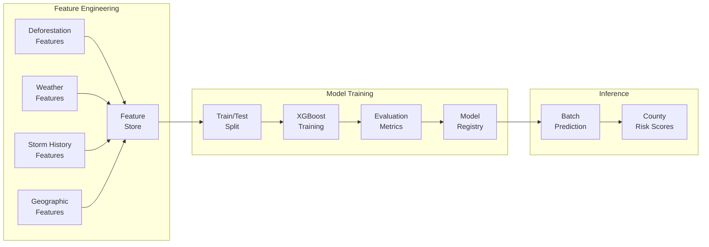
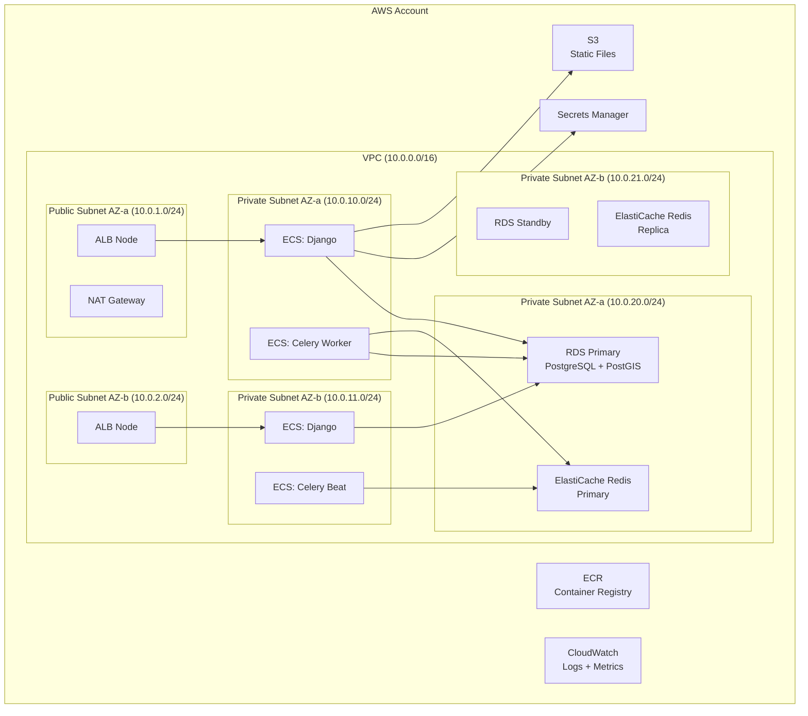

# ArborWatch — US Deforestation & Severe Weather Tracking Platform

A Django portfolio project that ingests US deforestation data, overlays temperature extremes and severe weather events, and uses ML models to predict heat waves, hurricanes, and tornadoes across the United States.

**Domain**: `arborwatch.net`  
**CI/CD**: GitHub Actions  
**Project Name**: ArborWatch

> [!IMPORTANT]
> This is a **long-timeline roadmap** split into 8 sequential phases. Each phase is designed to be independently deployable and testable. The UI is intentionally deferred to Phase 8.

---

## Architecture Overview



---

## Data Sources

| Source | Dataset | Endpoint / Access | Data Type | Refresh |
|--------|---------|-------------------|-----------|---------|
| **Global Forest Watch** | Tree Cover Loss (Hansen/UMD) | `https://data-api.globalforestwatch.org/dataset/umd_tree_cover_loss` | Annual raster → aggregated stats per county/state | Weekly Celery task |
| **Global Forest Watch** | Integrated Alerts (GLAD/RADD) | `https://data-api.globalforestwatch.org/dataset/gfw_integrated_alerts` | Near-real-time deforestation alerts | Daily Celery task |
| **USGS NLCD** | Tree Canopy Cover | MRLC bulk download (2011–2021) | Raster GeoTIFF — one-time seed + periodic | Quarterly |
| **NOAA NCEI** | Daily Climate Summaries | `https://www.ncei.noaa.gov/access/services/data/v1?dataset=daily-summaries` | Station-level daily TMAX/TMIN/PRCP | Daily Celery task |
| **NOAA Storm Events** | Storm Events Database | Bulk CSV download from `ncdc.noaa.gov/stormevents/` | Historical severe weather events (1950–present) | Monthly Celery task |
| **NWS** | Active Alerts | `https://api.weather.gov/alerts/active` | Real-time severe weather alerts (JSON-LD) | Every 15 min Celery task |

---

## User Review Required

> [!IMPORTANT]
> **API Keys Required**: Global Forest Watch and NOAA NCEI (CDO v2 fallback) require API keys. These will be managed via environment variables locally and AWS Secrets Manager in production.

> [!WARNING]
> **PostGIS Dependency**: The geospatial overlay features require PostgreSQL + PostGIS. This adds complexity to local development (Docker handles it) and requires RDS PostgreSQL with PostGIS extension in AWS.

> [!IMPORTANT]
> **Cost Implications**: The AWS deployment (ECS Fargate + RDS + ElastiCache + S3 + CloudFront) will incur ongoing costs. The Terraform configs will use `t3.micro`/`t3.small` instances where possible to keep costs low during development.

---

## Resolved Decisions

| Decision | Resolution |
|----------|------------|
| **Domain** | `arborwatch.net` |
| **CI/CD** | GitHub Actions |
| **API Keys** | Document signup steps for GFW and NOAA (user will obtain) |
| **Risk Model** | ML-based prediction (scikit-learn / XGBoost) — not simple heuristics |
| **Project Name** | ArborWatch |

---

## Phase 1 — Project Scaffolding & Docker Environment

**Goal**: Production-grade Django project structure, fully Dockerized local development with PostgreSQL/PostGIS, Redis, and Celery.

### Django Apps Decomposition

| App | Responsibility |
|-----|---------------|
| `core` | Shared models (BaseModel with audit fields), custom user model, permissions, health checks |
| `geodata` | US geographic boundaries — states, counties, FIPS codes, GeoJSON geometries (PostGIS) |
| `deforestation` | Tree cover loss data, deforestation alerts, canopy metrics |
| `weather` | Temperature observations, station data, climate normals |
| `storms` | Severe weather events, NWS active alerts |
| `analysis` | ML-based risk prediction engine, feature engineering, model registry, SHAP explainability |
| `api` | DRF routers, versioned viewsets, serializers, filters, pagination |
| `ingest` | Celery tasks, API clients for external data sources, ETL pipelines |

### Proposed Changes

#### [NEW] Docker & Compose

- `Dockerfile` — Multi-stage Python build (slim base, poetry/pip install, gunicorn entrypoint)
- `docker-compose.yml` — Services: `web`, `celery-worker`, `celery-beat`, `flower`, `postgres` (PostGIS), `redis`
- `docker-compose.override.yml` — Dev overrides (volume mounts, debug mode, hot reload)
- `.env.example` — Template for all environment variables

#### [NEW] Django Project

- `config/` — Django project package (`settings/`, `urls.py`, `wsgi.py`, `asgi.py`, `celery.py`)
- `config/settings/base.py` — Shared settings (installed apps, middleware, DRF config, Celery config)
- `config/settings/local.py` — Local dev overrides (DEBUG=True, console email backend)
- `config/settings/production.py` — Production settings (S3 storage, security headers, logging)
- `config/celery.py` — Celery app factory with autodiscover, queue routing, Beat schedule

#### [NEW] Dependency Management

- `requirements/base.txt` — Core deps: Django, DRF, celery, redis, psycopg2, django-filter, drf-spectacular, django-celery-beat
- `requirements/ml.txt` — ML deps: scikit-learn, xgboost, shap, pandas, numpy, joblib
- `requirements/local.txt` — Dev deps: pytest-django, factory-boy, faker, coverage, flake8, black, isort
- `requirements/production.txt` — Prod deps: gunicorn, django-storages, boto3, sentry-sdk, whitenoise

#### [NEW] `core` App

- Custom `User` model extending `AbstractUser` (planned for future admin/auth features)
- `BaseModel` abstract model with `created_at`, `updated_at`, `is_active` audit fields
- Health check endpoint (`/api/health/`) returning DB and Redis connectivity status
- Management command: `wait_for_db` (for Docker startup ordering)

#### [NEW] Tooling & Quality

- `pyproject.toml` — Black, isort, pytest, mypy configuration
- `Makefile` — Common commands (`make up`, `make down`, `make migrate`, `make test`, `make lint`)
- `.github/workflows/ci.yml` — Lint + test on push/PR
- `scripts/entrypoint.sh` — Container entrypoint (wait for DB, run migrations, collect static, start gunicorn)

---

## Phase 2 — Geographic Foundation (`geodata` App)

**Goal**: Seed the database with US geographic boundaries at state and county levels with PostGIS geometries. This is the spatial foundation everything else joins against.

### Data Model

```python
# geodata/models.py

class State(BaseModel):
    """US state boundaries with PostGIS geometries."""
    fips_code = CharField(max_length=2, unique=True, db_index=True)
    name = CharField(max_length=100)
    abbreviation = CharField(max_length=2)
    geometry = MultiPolygonField(srid=4326)  # from django.contrib.gis
    area_sq_km = DecimalField(max_digits=12, decimal_places=2)
    population = IntegerField(null=True)  # Census data

class County(BaseModel):
    """US county boundaries with PostGIS geometries."""
    fips_code = CharField(max_length=5, unique=True, db_index=True)
    name = CharField(max_length=100)
    state = ForeignKey(State, related_name='counties')
    geometry = MultiPolygonField(srid=4326)
    area_sq_km = DecimalField(max_digits=12, decimal_places=2)
    population = IntegerField(null=True)
```

### Proposed Changes

#### [NEW] `geodata/` App

- `models.py` — `State`, `County` models with PostGIS `MultiPolygonField`
- `management/commands/seed_geodata.py` — Ingest US Census Bureau TIGER/Line shapefiles for all 50 states + DC + territories, all ~3,200 counties
- `serializers.py` — GeoJSON serializers using DRF + `rest_framework_gis`
- `viewsets.py` — Read-only viewsets for states/counties with spatial filtering (`ST_Contains`, `ST_Intersects`)
- `filters.py` — Filter by state abbreviation, FIPS code, bounding box
- `tests/` — Factory-generated test geometries, viewset integration tests

#### [MODIFY] `config/settings/base.py`
- Add `django.contrib.gis` to `INSTALLED_APPS`
- Add `rest_framework_gis` to `INSTALLED_APPS`
- Configure `DATABASES` engine to `django.contrib.gis.db.backends.postgis`

#### [MODIFY] `requirements/base.txt`
- Add `djangorestframework-gis`, `GDAL` bindings

---

## Phase 3 — Deforestation Data Pipeline (`deforestation` + `ingest`)

**Goal**: Build the Celery-powered ETL pipeline that pulls tree cover loss data from Global Forest Watch and stores it against county/state geometries.

### Data Model

```python
# deforestation/models.py

class TreeCoverBaseline(BaseModel):
    """Baseline tree cover percentage for a geographic area in a given year."""
    county = ForeignKey(County, related_name='tree_cover_baselines')
    year = IntegerField(db_index=True)
    tree_cover_percent = DecimalField(max_digits=5, decimal_places=2)
    tree_cover_area_ha = DecimalField(max_digits=12, decimal_places=2)
    data_source = CharField(max_length=50)  # 'GFW' or 'NLCD'
    raw_payload = JSONField(null=True)  # Original API response for audit

    class Meta:
        unique_together = ['county', 'year', 'data_source']

class TreeCoverLoss(BaseModel):
    """Annual tree cover loss for a geographic area."""
    county = ForeignKey(County, related_name='tree_cover_losses')
    year = IntegerField(db_index=True)
    loss_area_ha = DecimalField(max_digits=12, decimal_places=2)
    loss_percent = DecimalField(max_digits=5, decimal_places=2)
    primary_driver = CharField(max_length=100, null=True)  # fire, urbanization, etc.
    data_source = CharField(max_length=50)
    raw_payload = JSONField(null=True)

    class Meta:
        unique_together = ['county', 'year', 'data_source']

class DeforestationAlert(BaseModel):
    """Near-real-time deforestation alert from GLAD/RADD."""
    alert_date = DateField(db_index=True)
    confidence = CharField(max_length=20)  # 'high', 'nominal'
    location = PointField(srid=4326)
    county = ForeignKey(County, related_name='deforestation_alerts', null=True)
    alert_type = CharField(max_length=50)  # 'GLAD', 'RADD'
    area_ha = DecimalField(max_digits=10, decimal_places=4, null=True)
    raw_payload = JSONField(null=True)
```

### Proposed Changes

#### [NEW] `deforestation/` App

- `models.py` — `TreeCoverBaseline`, `TreeCoverLoss`, `DeforestationAlert`
- `serializers.py` — Full CRUD serializers with nested county info, GeoJSON point serializer for alerts
- `viewsets.py` — Filterable viewsets (by year range, county, state, loss threshold)
- `filters.py` — Custom filters: `year__gte`, `year__lte`, `state`, `loss_percent__gte`
- `admin.py` — Django admin with list filters, search, map widget for alerts
- `tests/` — Model tests, serializer validation, viewset integration

#### [NEW] `ingest/` App

- `clients/gfw_client.py` — GFW Data API client (authentication, rate limiting, retry logic with exponential backoff)
- `clients/base.py` — Abstract base client with shared retry/timeout/logging patterns
- `tasks/deforestation_tasks.py`:
  - `ingest_tree_cover_loss` — Celery task: queries GFW for each state's counties, upserts `TreeCoverLoss` records
  - `ingest_deforestation_alerts` — Celery task: pulls latest GLAD/RADD alerts, reverse-geocodes to county
  - `ingest_tree_cover_baseline` — Celery task: one-time seed of baseline canopy data
- `signals.py` — Post-ingest signals for triggering analysis recalculation
- `tests/` — Mocked API responses, task unit tests with `@override_settings(CELERY_ALWAYS_EAGER=True)`

#### [MODIFY] `config/celery.py`
- Register deforestation task schedules in Beat:
  - `ingest_tree_cover_loss` — weekly (Sunday 02:00 UTC)
  - `ingest_deforestation_alerts` — daily (04:00 UTC)
- Configure queue routing: `ingest` queue for all data ingestion tasks

---

## Phase 4 — Weather & Storm Data Pipeline (`weather` + `storms`)

**Goal**: Ingest NOAA temperature data and severe weather events. Map observations to counties via station coordinates.

### Data Model

```python
# weather/models.py

class WeatherStation(BaseModel):
    """NOAA weather observation station."""
    station_id = CharField(max_length=20, unique=True, db_index=True)
    name = CharField(max_length=200)
    location = PointField(srid=4326)
    county = ForeignKey(County, related_name='weather_stations', null=True)
    elevation_m = DecimalField(max_digits=7, decimal_places=2, null=True)
    is_active = BooleanField(default=True)

class TemperatureObservation(BaseModel):
    """Daily temperature observation from a weather station."""
    station = ForeignKey(WeatherStation, related_name='observations')
    date = DateField(db_index=True)
    tmax_celsius = DecimalField(max_digits=5, decimal_places=1, null=True)
    tmin_celsius = DecimalField(max_digits=5, decimal_places=1, null=True)
    tavg_celsius = DecimalField(max_digits=5, decimal_places=1, null=True)
    precipitation_mm = DecimalField(max_digits=7, decimal_places=1, null=True)

    class Meta:
        unique_together = ['station', 'date']
        indexes = [
            Index(fields=['date', 'tmax_celsius']),  # For heat wave queries
        ]

# storms/models.py

class StormEvent(BaseModel):
    """NOAA Storm Events Database record."""
    event_id = CharField(max_length=20, unique=True, db_index=True)
    event_type = CharField(max_length=50, db_index=True)  # 'Tornado', 'Hurricane', 'Heat', etc.
    begin_date = DateTimeField(db_index=True)
    end_date = DateTimeField(null=True)
    state = ForeignKey(State, related_name='storm_events')
    county = ForeignKey(County, related_name='storm_events', null=True)
    begin_location = PointField(srid=4326, null=True)
    end_location = PointField(srid=4326, null=True)
    magnitude = DecimalField(max_digits=7, decimal_places=2, null=True)
    magnitude_type = CharField(max_length=10, null=True)  # 'EF' for tornadoes, 'kt' for hurricanes
    deaths_direct = IntegerField(default=0)
    injuries_direct = IntegerField(default=0)
    damage_property_usd = DecimalField(max_digits=15, decimal_places=2, default=0)
    damage_crops_usd = DecimalField(max_digits=15, decimal_places=2, default=0)
    episode_narrative = TextField(null=True)
    event_narrative = TextField(null=True)

    class Meta:
        indexes = [
            Index(fields=['event_type', 'begin_date']),
            Index(fields=['county', 'event_type']),
        ]

class ActiveAlert(BaseModel):
    """Real-time NWS severe weather alert."""
    alert_id = CharField(max_length=100, unique=True)
    event_type = CharField(max_length=100)
    severity = CharField(max_length=20)  # 'Extreme', 'Severe', 'Moderate', 'Minor'
    urgency = CharField(max_length=20)
    certainty = CharField(max_length=20)
    headline = TextField()
    description = TextField()
    instruction = TextField(null=True)
    effective = DateTimeField()
    expires = DateTimeField()
    affected_zones = JSONField()  # List of NWS zone codes
    geometry = MultiPolygonField(srid=4326, null=True)
```

### Proposed Changes

#### [NEW] `weather/` App

- `models.py` — `WeatherStation`, `TemperatureObservation`
- `serializers.py` — Station serializer with nested latest observation, observation time-series serializer
- `viewsets.py` — Filterable by county, state, date range; aggregation endpoint for avg/max/min per county
- `admin.py` — Map widget for stations, date range filters for observations

#### [NEW] `storms/` App

- `models.py` — `StormEvent`, `ActiveAlert`
- `serializers.py` — Event serializer with GeoJSON geometry, alert serializer
- `viewsets.py` — Filter by event type, date range, state/county, magnitude
- `admin.py` — Event type filters, damage summaries

#### [NEW] `ingest/clients/noaa_client.py`

- NCEI Data Service API client for temperature data
- Storm Events CSV bulk downloader and parser
- NWS API client for active alerts (JSON-LD parsing)

#### [NEW] `ingest/tasks/weather_tasks.py`

- `ingest_temperature_observations` — Daily: pulls yesterday's TMAX/TMIN for all active stations
- `ingest_weather_stations` — Monthly: refreshes station metadata, reverse-geocodes to counties
- `sync_station_counties` — Spatial join: maps stations to counties using PostGIS `ST_Contains`

#### [NEW] `ingest/tasks/storm_tasks.py`

- `ingest_storm_events` — Monthly: downloads latest Storm Events CSV, parses, upserts
- `ingest_active_alerts` — Every 15 min: polls NWS API, upserts/expires alerts
- `seed_historical_storms` — One-time: bulk load historical storm events (1950–present)

#### [MODIFY] `config/celery.py`

- Add weather/storm task schedules to Beat
- Add `weather` and `alerts` queues for task routing
- Configure `alerts` queue as high-priority

---

## Phase 5 — ML-Based Risk Prediction Engine (`analysis`)

**Goal**: The core value — use machine learning to predict county-level risk for heat waves, hurricanes, and tornadoes by training on the overlay of deforestation, temperature, and historical storm data.

### ML Pipeline Architecture



### Feature Engineering

**Deforestation Features** (per county, rolling windows):
- Tree cover loss rate (1yr, 3yr, 5yr, 10yr)
- Current tree cover percentage
- Loss acceleration (2nd derivative)
- Dominant loss driver (categorical: fire, urbanization, agriculture)
- Cumulative loss since baseline

**Weather Features** (per county, rolling windows):
- TMAX: mean, max, 95th percentile (summer months)
- Days above 35°C / 40°C thresholds (1yr, 5yr)
- Temperature trend (linear regression slope over 5yr, 10yr)
- Precipitation deficit (drought proxy)
- Seasonal temperature variance

**Storm History Features** (per county):
- Event frequency by type (1yr, 5yr, 10yr, all-time)
- Average/max magnitude by type
- Cumulative damage (property + crop, inflation-adjusted)
- Casualties per event
- Recency-weighted event score

**Geographic Features** (static per county):
- Latitude, longitude (centroid)
- Elevation (mean, min, max)
- Coastal distance (km)
- Area (sq km)
- FEMA region
- Adjacent county average features (spatial lag)

### Models

| Risk Type | Model | Target Variable | Training Labels |
|-----------|-------|----------------|----------------|
| **Heat Wave** | XGBoost Classifier | Binary: heat event in next 90 days | Historical heat events from Storm Events DB |
| **Hurricane** | XGBoost Classifier | Binary: hurricane/tropical storm impact in next season | Historical hurricane events |
| **Tornado** | XGBoost Classifier | Binary: tornado event in next 90 days | Historical tornado events |
| **Severity** | XGBoost Regressor | Damage magnitude (log-scaled) | Historical damage values |

### Model Management

- **Training**: Celery task triggered monthly or on-demand via admin
- **Versioning**: Each trained model saved with metadata (features, hyperparams, metrics) to S3
- **A/B comparison**: New model must beat current champion on holdout set before promotion
- **Explainability**: SHAP values computed per prediction for feature importance transparency

### Data Model

```python
# analysis/models.py

class CountyRiskScore(BaseModel):
    """Computed risk score for a county."""
    county = ForeignKey(County, related_name='risk_scores')
    risk_type = CharField(max_length=20)  # 'heat_wave', 'hurricane', 'tornado'
    score = DecimalField(max_digits=5, decimal_places=2)  # 0-100
    confidence = DecimalField(max_digits=5, decimal_places=2)  # 0-100
    computed_at = DateTimeField()
    factors = JSONField()  # Breakdown: {"tree_loss": 28.5, "historical_freq": 22.0, ...}
    data_window_start = DateField()
    data_window_end = DateField()

    class Meta:
        unique_together = ['county', 'risk_type', 'computed_at']
        indexes = [
            Index(fields=['risk_type', 'score']),
            Index(fields=['county', 'risk_type', '-computed_at']),
        ]

class RiskTrend(BaseModel):
    """Time-series of risk score changes for trend analysis."""
    county = ForeignKey(County, related_name='risk_trends')
    risk_type = CharField(max_length=20)
    month = DateField()  # First of month
    avg_score = DecimalField(max_digits=5, decimal_places=2)
    delta_from_previous = DecimalField(max_digits=6, decimal_places=2, null=True)

    class Meta:
        unique_together = ['county', 'risk_type', 'month']
```

### Proposed Changes

#### [NEW] `analysis/` App

- `models.py` — `CountyRiskScore`, `RiskTrend`, `MLModel` (model registry), `FeatureSnapshot`
- `features/base.py` — Abstract `FeatureExtractor` base class
- `features/deforestation.py` — Deforestation feature extraction (rolling windows, derivatives)
- `features/weather.py` — Weather/temperature feature extraction
- `features/storms.py` — Storm history feature extraction
- `features/geographic.py` — Static geographic features
- `features/pipeline.py` — Feature pipeline orchestrator: assembles feature matrix for all counties
- `ml/base.py` — Abstract `RiskPredictor` base class with `train()`, `predict()`, `evaluate()`
- `ml/heat_wave.py` — `HeatWavePredictor` (XGBoost classifier)
- `ml/hurricane.py` — `HurricanePredictor` (XGBoost classifier)
- `ml/tornado.py` — `TornadoPredictor` (XGBoost classifier)
- `ml/registry.py` — Model versioning, S3 persistence, champion/challenger management
- `ml/explainability.py` — SHAP value computation for per-prediction feature importance
- `services.py` — Orchestration: feature build → train/predict → score persistence
- `serializers.py` — Risk score serializers with SHAP-based factor breakdown, trend serializer, model metadata serializer
- `viewsets.py` — Endpoints: county risk scores, risk rankings, trends, model performance, feature importance
- `admin.py` — Score distribution histograms, top-risk counties, model registry admin

#### [NEW] `ingest/tasks/analysis_tasks.py`

- `build_feature_matrix` — Weekly Celery task: extracts features for all counties, stores as `FeatureSnapshot`
- `train_risk_models` — Monthly Celery task: retrains all three models on latest features
- `predict_county_risk_scores` — Weekly Celery task: runs inference for all counties using champion models
- `compute_risk_trends` — Monthly Celery task: generates trend data from historical scores
- `recompute_single_county` — On-demand task triggered via API or admin action
- `evaluate_challenger_model` — On-demand: trains and evaluates a new model against champion

#### [NEW] DRF API Endpoints (Phase 5 additions to `api/`)

| Method | Endpoint | Description |
|--------|----------|-------------|
| GET | `/api/v1/analysis/risk-scores/` | List risk scores with filters |
| GET | `/api/v1/analysis/risk-scores/{county_fips}/` | All risk scores for a county |
| GET | `/api/v1/analysis/risk-scores/{county_fips}/explain/` | SHAP feature importance for a prediction |
| GET | `/api/v1/analysis/rankings/` | Top-N counties by risk type |
| GET | `/api/v1/analysis/trends/{county_fips}/` | Risk trends for a county |
| GET | `/api/v1/analysis/models/` | Model registry — versions, metrics, status |
| GET | `/api/v1/analysis/models/{model_id}/performance/` | Precision, recall, AUC for a model |
| POST | `/api/v1/analysis/recompute/{county_fips}/` | Trigger recompute (admin only) |
| POST | `/api/v1/analysis/train/` | Trigger model retraining (admin only) |

---

## Phase 6 — Comprehensive DRF API (`api`)

**Goal**: Polish the full REST API with versioning, authentication, throttling, documentation, and advanced query capabilities. This is where Django/DRF mastery is showcased.

### Proposed Changes

#### [MODIFY] `api/` App — Full API Build-Out

**Versioning & URL Structure:**
```
/api/v1/
├── health/                     # Health check
├── geodata/
│   ├── states/                 # List/detail with GeoJSON
│   └── counties/               # List/detail with spatial filters
├── deforestation/
│   ├── tree-cover/             # Baseline & loss data
│   ├── alerts/                 # Near-real-time alerts
│   └── summary/               # Aggregated stats
├── weather/
│   ├── stations/               # Station metadata
│   ├── observations/           # Temperature time-series
│   └── summary/               # Aggregated temp stats
├── storms/
│   ├── events/                 # Historical storm events
│   ├── alerts/                 # Active NWS alerts
│   └── summary/               # Storm frequency stats
├── analysis/
│   ├── risk-scores/            # County risk scores
│   ├── rankings/               # Risk rankings
│   ├── trends/                 # Risk trends
│   └── overlay/                # Combined deforestation + weather overlay
└── tasks/
    └── status/{task_id}/       # Celery task status polling
```

**DRF Features to Showcase:**
- **Custom permissions** — `IsAdminOrReadOnly`, `CanTriggerRecompute`
- **Throttling** — Tiered rates: anonymous (100/hour), authenticated (1000/hour), admin (unlimited)
- **Pagination** — `CursorPagination` for time-series data, `PageNumberPagination` for lists
- **Filtering** — `django-filter` integration with custom `FilterSet` classes, spatial filters via `rest_framework_gis`
- **Serializers** — Nested serializers, `SerializerMethodField` for computed properties, `HyperlinkedModelSerializer`
- **Content negotiation** — JSON (default), GeoJSON, CSV export
- **Schema/Docs** — `drf-spectacular` for OpenAPI 3.0 schema, Swagger UI at `/api/docs/`, ReDoc at `/api/redoc/`
- **Caching** — Per-view cache with `cache_page`, ETags, conditional requests
- **Bulk operations** — Batch create/update endpoints for admin ingestion
- **Custom actions** — `@action` decorators for non-CRUD operations (e.g., `export_csv`, `recompute`)
- **Signals + Webhooks** — Optional webhook notifications when risk scores change significantly
- **API versioning** — `URLPathVersioning` with `v1` namespace

#### [NEW] `api/permissions.py` — Custom permission classes
#### [NEW] `api/throttling.py` — Custom throttle classes
#### [NEW] `api/pagination.py` — Custom pagination classes
#### [NEW] `api/renderers.py` — CSV and GeoJSON renderers
#### [NEW] `api/exceptions.py` — Custom exception handler with structured error responses
#### [NEW] `api/middleware.py` — Request logging, correlation ID middleware
#### [NEW] `api/tests/` — Comprehensive API integration tests (auth, throttling, filtering, pagination)

---

## Phase 7 — Docker Production Build & AWS Deployment

**Goal**: Production-ready Docker images, Terraform IaC for AWS infrastructure, CI/CD pipeline.

### AWS Architecture



### Proposed Changes

#### [NEW] `infra/terraform/`

- `main.tf` — Provider config, backend (S3 for state)
- `vpc.tf` — VPC, subnets (2 public, 4 private), NAT gateways, route tables
- `security_groups.tf` — SGs for ALB, ECS, RDS, ElastiCache
- `rds.tf` — PostgreSQL 15 with PostGIS, Multi-AZ, encrypted
- `elasticache.tf` — Redis cluster, encryption in transit
- `ecs.tf` — Cluster, task definitions (web, worker, beat, flower), services, auto-scaling
- `ecr.tf` — Container registry
- `alb.tf` — Application Load Balancer, target groups, health checks
- `s3.tf` — Static files bucket, bucket policy
- `secrets.tf` — Secrets Manager resources
- `cloudwatch.tf` — Log groups, metric alarms
- `variables.tf` — Environment-specific variables
- `outputs.tf` — ALB DNS, RDS endpoint, Redis endpoint

#### [MODIFY] `Dockerfile`

- Production multi-stage build:
  1. **Builder stage**: Install dependencies
  2. **Runtime stage**: Copy only necessary files, non-root user, health check
- Separate `Dockerfile.worker` for Celery (same base, different entrypoint)

#### [NEW] `.github/workflows/deploy.yml`

- Triggered on push to `main`
- Steps: Lint → Test → Build Docker image → Push to ECR → Update ECS service
- Environment-gated (staging → production with manual approval)

#### [NEW] `scripts/`

- `deploy.sh` — Terraform apply wrapper with environment selection
- `migrate.sh` — Run migrations via ECS one-off task
- `seed.sh` — Run seed commands via ECS one-off task

---

## Phase 8 — Frontend (React) — Deferred

**Goal**: Minimal React SPA served by Django (or separate S3/CloudFront deployment) for data visualization.

> [!NOTE]
> This phase is intentionally last. The API is the primary deliverable. The frontend is a thin visualization layer.

### Planned Features (Minimal)

- **Dashboard**: County-level risk scores on an interactive US map (Leaflet or Mapbox GL)
- **County Detail**: Risk breakdown, trend charts, recent alerts
- **Data Explorer**: Filter/search deforestation and weather data
- **Alert Feed**: Live NWS severe weather alerts

### Tech

- React 18 + Vite
- Leaflet for mapping
- Chart.js or Recharts for data visualization
- Served as Django static files or separate S3 deployment behind CloudFront

---

## Verification Plan

### Automated Tests (Each Phase)

```bash
# Unit + integration tests
make test

# Coverage report
make coverage

# Linting
make lint

# Type checking
make typecheck
```

### Phase-Specific Verification

| Phase | Verification |
|-------|-------------|
| 1 | `docker-compose up` starts all services; `GET /api/health/` returns 200 |
| 2 | `manage.py seed_geodata` populates all 50 states + 3,200 counties; GeoJSON endpoint returns valid geometry |
| 3 | Celery tasks complete successfully with mocked GFW responses; `TreeCoverLoss` records created; API filters work |
| 4 | NOAA ingest tasks populate temperature and storm data; spatial joins map stations to counties |
| 5 | Risk engine produces scores 0–100 for sample counties; scores update when underlying data changes |
| 6 | OpenAPI spec validates; throttling enforced; all endpoints return correct pagination/filtering |
| 7 | `terraform plan` succeeds; Docker images build and run; ECS deployment completes; health check passes through ALB |
| 8 | React app loads; map renders; county selection shows risk data from API |

### Manual Verification

- Verify data accuracy by spot-checking GFW and NOAA source data against ingested records
- Compare risk scores against known high-risk areas (e.g., Hurricane Alley, Tornado Alley, Pacific Northwest fire regions)
- Load test API with `locust` or `k6` to verify performance under concurrent requests
